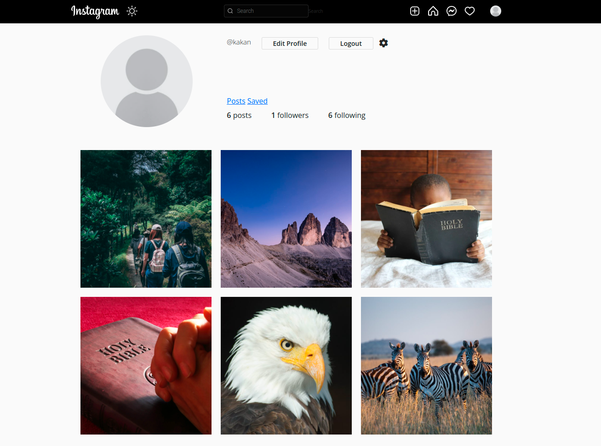
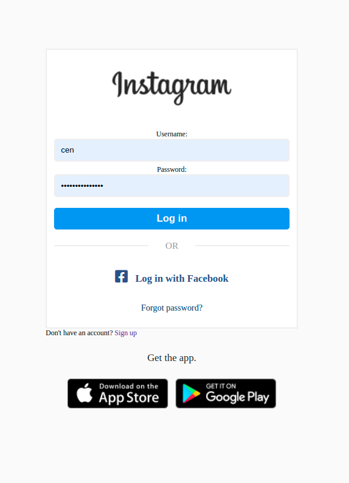

<<<<<<< HEAD
<<<<<<< HEAD
## App Name
* Instagram-clone

>>>>>>> 6e1388404dd44209b9e5f943f94225d3e68f8745

## Author
* Innoncencia Kakan.

## Description:
Instagram-clone is an app that enables a client sign in , upload pics, see profile with all uploaded pics, follow other users and see their profile, like pic and comment

## Live link:
<<<<<<< HEAD
https://picsinsta.herokuapp.com/
=======

>>>>>>> 6e1388404dd44209b9e5f943f94225d3e68f8745

##

## User stories

* A user can Sign in to the application to start using.
* A user can Upload their pictures to the application. 
* A user can See my profile with all their pictures.
* A user can Follow other users and see their pictures on their timeline.
* A user can Like a picture and leave a comment on it.

## Setup/Installation Requirements
* First clone the repo $ git clone https://github.com/Cencious/instagram-clone.git

* After cloning, navigate to the project: $ cd Instagram_clone

* On your terminal run the command:- for vscode, code .| for atom, atom .

* Run the application: $ python manage.py runserver

* Now navigate to your browser at: localhost://127.0.0.8000/

## Technologies Used
* Python3  
* Django4  
* Heroku- for deployment

## Support and contact details
* Feel free to reach out via email address kancencious@gmail.com

## License
MIT License

Copyright (c) 2022 Innoncencia Kakan/instagram-clone
=======
>>>>>>> 01cb0c3566b258527b5aeef8bc4d122ce1ce69c4

<<<<<<< HEAD
=======

>>>>>>> 6e1388404dd44209b9e5f943f94225d3e68f8745
